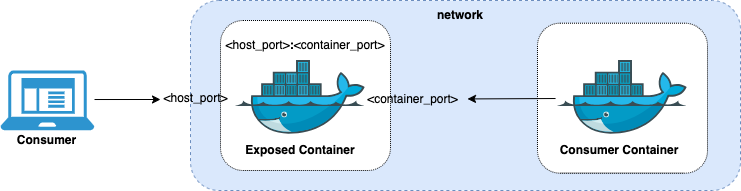

# Inception

## Table of Contents
* [Docker Commands](#docker-commands)
* [Dockerfile](#dockerfile)
* [Docker Compose](#docker-compose)
* [Docker Compose Commands](#docker-compose-commands)
* [Docker Compose File](#docker-compose-file)
* [Resources](#resources)

## Docker Commands

In some systems the docker daemon starts automatically. To start it manually use: ```sudo systemctl start docker```

| Command | Action |
| -- | -- |
| ```docker build [{-f \| --file} <name>.Dockerfile] <path_context>``` | Build image from Dockerfile |
| ```docker image ls``` | List images |
| ```docker inspect <id>``` | Inspect image |
| ```docker history``` | See run history |

## Dockerfile

Docker builds images by reading the instructions from a ```Dockerfile```. A ```Dockerfile``` is a text file containing instructions for building your source code. ```Dockerfile```s are crucial inputs for image builds and can facilitate automated, multi-layer image builds based on your unique configurations. 

| Instruction | Description |
| -- | -- |
| ``` FROM <image> ``` | Defines a **base for your image**. |
| ``` RUN <command> ``` | Executes any commands in a new layer on top of the current image and commits the result. RUN also has a shell form for running commands. Use  ``` RUN --mount=type=bind ``` if you need to **add files from the build context to the container temporarily** to execute a RUN instruction. |
| ``` WORKDIR <directory> ``` | **Sets the working directory** for any RUN, CMD, ENTRYPOINT, COPY, and ADD instructions that follow it in the Dockerfile. If the WORKDIR **doesn't exist, it will be created** even if it's not used in any subsequent Dockerfile instruction. |
| ``` COPY <src> <dest> ``` | Copies **new files or directories** from \<src> and adds them to the filesystem of the container at the path \<dest>. |
| ``` ADD <src> <dest> ``` | Copies new files, directories or remote file URLs from \<src> and adds them to the filesystem of the image at the path \<dest>. Note: better use ``` COPY ``` to copy files and directories and **only use ``` ADD ``` to access remote file URLS** -do not use a tool such as wget or tar- |
| ``` CMD <command> ``` | Lets you define the default program that is run once you start the container based on this image. **Each Dockerfile only has one CMD, and only the last CMD instance is respected when multiple exist**. |

## Docker Compose

### Docker Compose Commands

| Command | Action |
| -- | -- |
| ```docker compose up [-d]``` | Builds, (re)creates, starts, and attaches to containers for a service. Use ```-d``` for detached mode -run containers in the background-. |
| ```docker compose down``` | Stops containers and removes containers, networks, volumes, and images created by ```up```. Use ```-v``` to remove named volumes declared in the "volumes" section of the Compose file and anonymous volumes attached to containers. |
| ```docker compose run <service> [<command>]``` | Runs a one-time command against a service. |
| ```docker compose stop``` | Stops your services if you have started them with ```docker compose up -d```. |
| ```docker compose ps``` | Lists containers for a Compose project, with current status and exposed ports. |
| ```docker compose config``` | Renders the actual data model to be applied on the Docker Engine. It merges the Compose files set by -f flags, resolves variables in the Compose file, and expands short-notation into the canonical format. |

### Docker Compose File

Docker Compose is a tool for defining and running multi-container applications. It is the key to unlocking a streamlined and efficient development and deployment experience.

Compose simplifies the control of your entire application stack, making it easy to manage services, networks, and volumes in a single, comprehensible YAML configuration file. Then, with a single command, you create and start all the services from your configuration file.

The default path for a Compose file is **```compose.yaml```** (preferred) or ```compose.yml``` that is placed in the working directory. Compose also supports ```docker-compose.yaml``` and ```docker-compose.yml``` for backwards compatibility of earlier versions. If both files exist, Compose prefers the canonical ```compose.yaml```.

#### .env File

An ```.env``` file in Docker Compose is a text file used to define environment variables that should be made available to Docker containers when running ```docker compose up```. This file typically contains key-value pairs of environment variables -values can be optionally single/double quoted-, and it allows you to centralize and manage configuration in one place. The ```.env``` file is useful if you have multiple environment variables you need to store.  

The ```.env``` file is the default method for setting environment variables in your containers. The ```.env``` file should be placed at the root of the project directory next to your ```compose.yaml``` file. In the ```compose.yaml``` use ```${<NAME>}``` where you want to interpoate a variable -```<NAME>``` is he key of the pair, braces are optional-.

**Be cautious about including sensitive data in environment variables**. Consider using [Secrets](https://docs.docker.com/compose/use-secrets/) for managing sensitive information.


#### Networking in Compose

By default Compose sets up a single network for your app. Each container for a service joins the default network and is both reachable by other containers on that network, and discoverable by the service's name.  
Your app's network is given a name based on the ```project_name``` -the network will be called ```<project_name>.default```, which is based on the name of the directory it lives in.  

```
ports:
	- "<host_port>:<container_port>"
```
It is important to note the distinction between ```host_port``` and ```container_port```. Networked service-to-service communication uses the ```container_port```. When ```host_port``` is defined, the service is accessible outside the swarm as well.



## Resources

* [Docker glossary](https://docs.docker.com/glossary/)
* [docker build showing "docker build" output](https://stackoverflow.com/questions/64804749/why-is-docker-build-not-showing-any-output-from-commands/64805337#64805337)
* [Docker CLI Reference](https://docs.docker.com/engine/reference/commandline/)
* [Dockerfile reference](https://docs.docker.com/engine/reference/builder/)  
* [Introduction to Dockerfile](https://docs.docker.com/build/building/packaging/)  
* [RUN --mount](https://docs.docker.com/engine/reference/builder/#run---mount)  
* [ADD or COPY](https://docs.docker.com/develop/develop-images/instructions/#add-or-copy)  
* [Hello docker-compose.yaml](https://docs.docker.com/compose/gettingstarted/)
